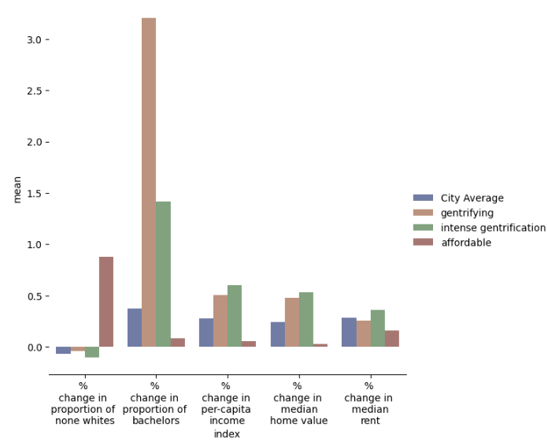

# Predicting-Gentrification-in-DC
## Washington was nearly half Black by the mid-20th century, and more than 71 percent by 1970, between the 2000 and 2020, accoring to the U.S. Census, the city’s Black population dropped from 59 to 41 percent. Today, D.C. has one of the highest rates of displacement in the country.Low-income residents are being pushed out of neighborhoods at some of the highest rates in the country, according to the Institute on Metropolitan Opportunity. Most of the people pushed out of these economic hot spots are black and low income, according to the data. In lieu of this explosive issue that faces DC, I sort ought to find whether we can predict which areas in DC are getting gentrified and more importanly "will" be gentrified. 

## Execution
 - Obtain a census API key: https://api.census.gov/data/key_signup.html
 - Run notebooks in the following order 
    1. `Data_preparation.ipynb`
    2. `Hierarchical_clustering.ipynb`
    3. `Random_Forest.ipynb`
  
## Gentrification 
Gentrification is a legacy of historical patterns of residential restructuring that trace back to the start of the 20th century. The end of World War II marks a mass exodus of affluent, white households from urban areas to the suburbs. The “white flight” movement was reflective of the preferences, policies, and market conditions throughout the fifties and sixties. Specific factors including systemic racism, redlining, municipal disinvestment, and the construction of the federal highway system helped to systematize the suburban movement (Zuk et al., 2015).Throughout the 1980’s gentrification was referred to as a “localized small scale process…purely temporary and of little long-term significance.” As we are well aware now over the previous fifty years, gentrification is neither temporary nor is it exclusive to the United States. 

While there is much debate on the definition of gentrification, the general patterns from a spacial point view does provide a succint definition: A sustained period of disinvestment, followed by an influx of investment and wealthier residents, in some cases correlated with race,  that results in the displacement of existing residents

## Data 
- American community survey's 5-year estimates(2012-2021): https://www.census.gov/data/developers/data-sets/acs-5year.html
- Method: API 
- Geography: Census Tract level 
- We are primarily interested in the variables literature suggests as "descriptive" of gentrification. These are 
    - Home values
    - Bachelor's+ educated population
    - Income. 
- Alongside, due to the increasingly stark spatial divide between races in DC, we are also interested in the proportion of non-white racial demograph, in a census tract and whether they also may show a pattern in the clusters 
- We further, separate  home value and rents as separate features, given an increasingly common phenomena of rents often increasing faster than home values as new wealthy / potentially wealthy ( recent college graduates) residents occupy a new neighborhood. 

## Pre-Processing 
- We drop census tracts wih populations below or equal to zero 
- We obtain multiple categorical values that require to be aggregated. For example, our raw data set has one variable indicating those with bachelors degrees, another variable with masters degree and so on. These variables need to be added for an aggregate population, classified as bachelors+
- We then create multiple per capita indicators. 
- We finally inflation adjust to 2021 all variables with monetary values. 
- We then utilise multiple imputation to fill missing values, since our final data set would be comparatively small. We will have each row = a census tract and DC has 154 census tracts, as our final dataset. Further, imputation is necessary, so that we do not drop potentially gentrifying tracts, since we expect the data to be highly imbalanced for gentrifying and non gentrifying tracts. 

-----------------------------------------------------------------------------------------------------------------------------------------------------------------------Before clustering we discuss some interesting insights: 

We see that median housing values are generally decreasing with increase in housing values in a given year. More interestingly over time areas with lower populations Black population, the number of high median housing value increases and subsequently free of relatively lower median house value tracts decreases with increased proportions of black populations. This may indicate towards the existence of  a racial dimension in understanding gentrification for the case of Washington DC. 

Median housing value and rent are clearly correlated as one expects.However over time instances of median housing for a given median rent being higher than previous years and the other way round for median rent , highlights that over time rent and home values are not moving together. This indicates that there maybe a need for separate variables for housing and rent in clusters. 

Other possible correlations are summarised below:

## Unsupervised learning: Hierarchical Clustering 
- Our feature list before we proceed to cluster are as follows: (note: % changes are b/w 2000 and 2021)
    1. % Change in porportion of non whites 
    2. % Change in per capita income 
    3. % Change in proportion of bachelor's+ educated population 
    4. % Change in Median housing value 
    5. % Change in Median rent 
- Our final dataset is relatively sparse consisting of 150 census tracts. 
- Given a small dataset and our goal to identify the most similar observations to a given data point, hierarchical agglomerative clustering is used. 
- We finally select 4 clusters for interpretability. These are: 
   1. Stable: Those tracts whose changes are most clost to the DC average
   2. Gentrifying: Those areas which have begin to show early signs of gentrification. 
   3. Intense gentrfication: Areas which show strong signs of gentrification accross all variables 
   4. Affordable: Those areas where signs of gentrification are lower than the DC average. 
           - Please note: The label "Affordable" may prompt you to visualise an "affordable" neighborhood, i.e. an area where prices are low. That is not the case here. Affordable is only classifying the "change" in prices as compared to DC. The initial and/or final prices may still be high, indicating minimal change in prices in a high income neighborhood. 

## Results : Clustering 

We plot the average values of each of the clusters, against the DC average. Once again we emphasize, that the "affordable" tract does not imply housing prices being affordable. The initial.final housing prices may still be high. These tracts only become affordable with respect to % change in price and rent values: 
    

Comparing the average values across tracts:

We observe that the clustering algorithm has created distinct clusters which exhibit differing neighborhood patterns. 
In out case "Gentrifying" and "Intense Gentrification", are those that show a much bigger decrease in propotion of none whites, much higher increases in median housing and/or rent as compared to the DC average. Finally, per capita change in incomes are much more increasing for these tracts.Gentrifying tracts have a much large change in proportion of bachelors+ population than intensely gentrifying tracts but lower changes in income per capita, median housing and rent values as compared to intensely gentrifying tracts. A possibility is that the recent influx of bachelors+ population in the "gentrifying" tracts will over time push these tracts into "intense gentrification."

## Spatially visualizing our clusters: 

Interestingly, many of the gentrifying/intensely gentrifying tracts correlate with the tracts of DC with the higher proportion of Black population, clearly indicating a racial dimension to gentrification. For DC natives, gentrification as seen between 2012 and 2021, has a strong concentration east of the Anacostsia river, may sound familiar, given ward 7 and 8s already identified risk of being gentrified

## Supervised Learning 
### Random Forest 
I now attempt to predict the probability of gentrification of a census tract over a 10 year horizon. We first predict on demographic data for tracts in the year 2000, using our output label as the clusters determined by hierarchical clutering previously.

## Methodology
- A random forest is used. Due to the class imbalance in the data set (19% as gentrifying), we generate synthetic data from the minority class in the training set using Synthetic Minority Oversampling Technique (SMOTE). 
- Our feature selection is based on what initial characteristics a tract may have, that may qualify it for "gentrification" over the next 10 years. We use the following variables for the tracts in the year 2000, to predict labels ( which itself have been predicted based on a 10-year change). 
- Features in random forest
  1. % of reisdent 65+ 
  2. % of residents below the poverty line 
  3. % of long term residents in the tract 
  4. % of vacant houses 
  5. % of aging housing stock (older than 1980)
  6. % of renters rent burdened 
  7. % of renters 
  8. % unemployed 
  9. Average per-capita income
- 

