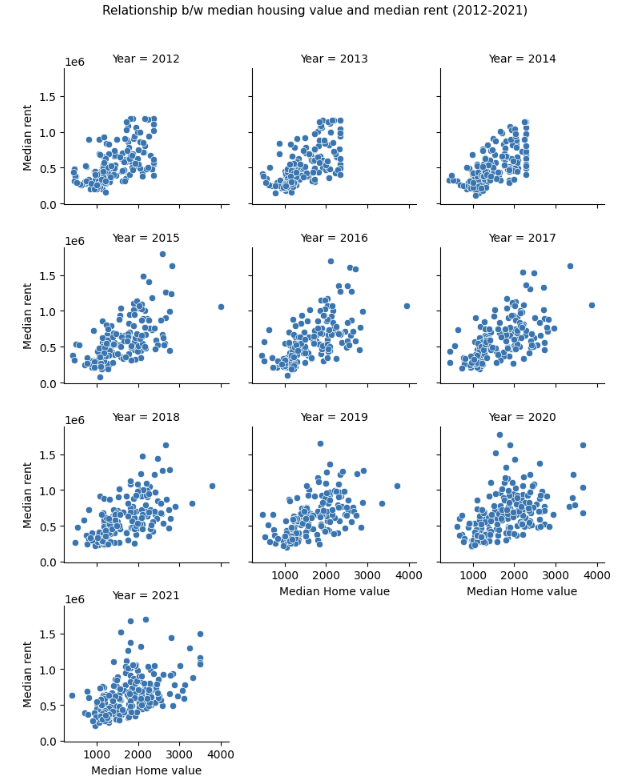
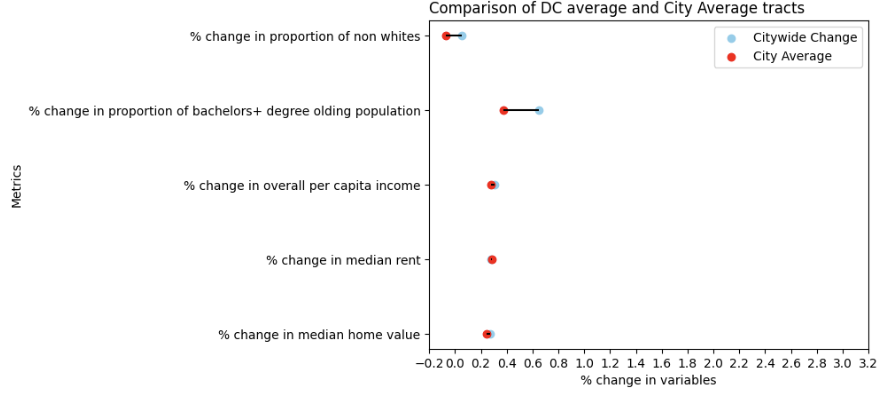
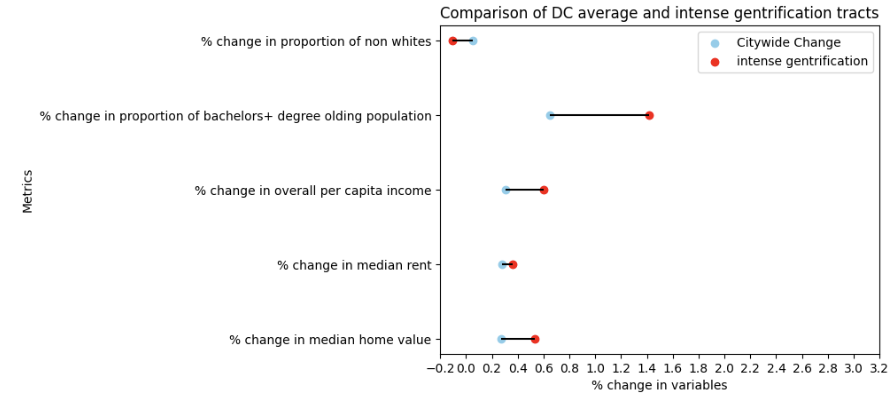
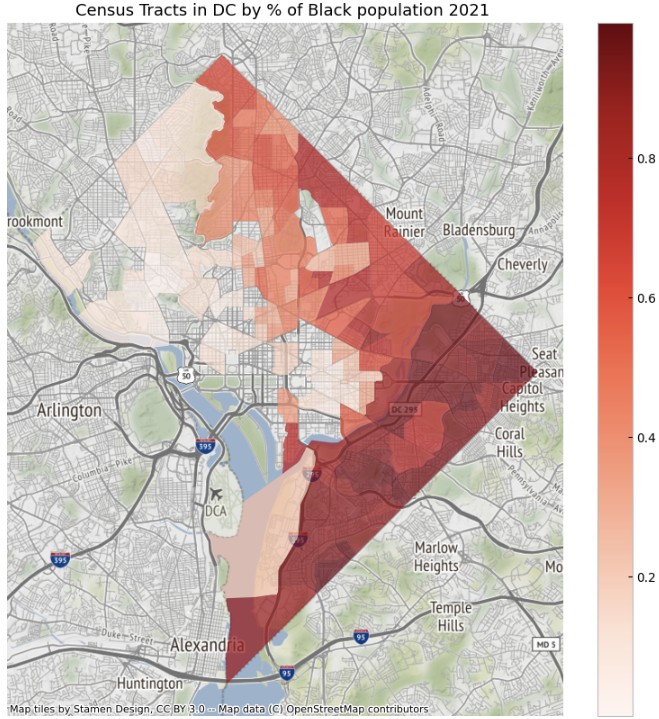
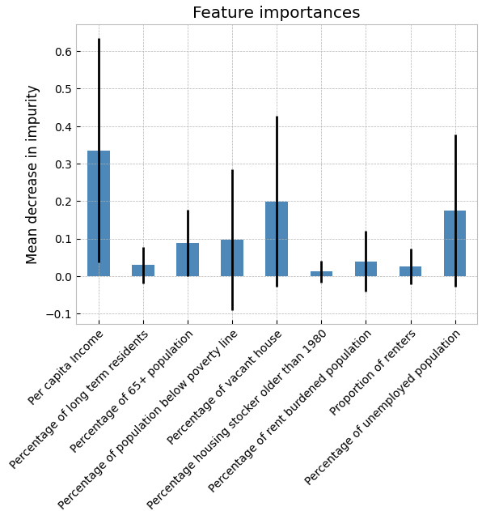
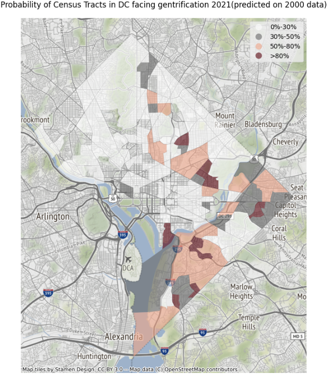

# Predicting-Gentrification-in-DC

#### I employ an unsupervised clustering technique to identify the trajectories of neighborhood change in Washington DC, measured by important census change variables. I identify a typology indicative of gentrification between 2012 and 2021 in 19% of the sampled census tracts. This method seeks to avoid the bias that traditional methods of identifying gentrification carry. The development of gentrification as a dependent variable merits a critical examination and transparent reporting of sensitivity.
#### I then attempt to develop a predictive model to identify at-risk neighborhoods for future gentrification. The identification of "gentrification" is gained from the classification obtained from the above mentioned clustering method. I train a random forest on various demographic, housing and socioeconomic data from the year 2000, also oversampling the training data using Synthetic Minority Oversampling to tackle the class imbalance in the data. Since clustering is based on the 10 year change in neighborhood characteristics, the random forest's predicitions for the probability of a tract gentrifying based on 2000 data, is projected for 2021 data. I achieve a testing accuracy of 87% or more representative of the class imbalance problem, a balanced testing accuracy of 91%. Finally, I use 2021 data, to use the trained random forest to predict the probability of gentification for tracts by 2031. 

## Execution
 - Obtain a census [API key](https://api.census.gov/data/key_signup.html)
 - Run notebooks in the following order 
    1. [`Data_preparation.ipynb`](https://github.com/AyushLahiri/Predicting-Gentrification-in-DC/blob/main/Data_preparation.ipynb)
    2. [`Hierarchical_clustering.ipynb`](https://github.com/AyushLahiri/Predicting-Gentrification-in-DC/blob/main/Unsup%20and%20Sup%20learning/Hierarchical_Clustering.ipynb)
    3. [`Random_Forest.ipynb`](https://github.com/AyushLahiri/Predicting-Gentrification-in-DC/blob/main/Unsup%20and%20Sup%20learning/Random_forest.ipynb)
  
## Gentrification 
Washington was more than 71 percent by 1970 but between 2000 and 2020, accoring to the U.S. Census, the city’s Black population dropped from 59 to 41 percent. Today, D.C. has one of the highest rates of displacement in the country.Low-income residents are being pushed out of neighborhoods at some of the highest rates in the country, according to the Institute on Metropolitan Opportunity. Most of the people pushed out of these economic hot spots are black and low income, according to the data. 

Gentrification is a legacy of historical patterns of residential restructuring that trace back to the start of the 20th century. The end of World War II marks a mass exodus of affluent, white households from urban areas to the suburbs. The “white flight” movement was reflective of the preferences, policies, and market conditions throughout the fifties and sixties. Specific factors including systemic racism, redlining, municipal disinvestment, and the construction of the federal highway system helped to systematize the suburban movement (Zuk et al., 2015).Throughout the 1980’s gentrification was referred to as a “localized small scale process…purely temporary and of little long-term significance.” As we are well aware now, over the previous fifty years, gentrification is neither temporary nor is it exclusive to the United States. 

While there are multiple classifications of gentrification, the general patterns from a spacial point view does provide a succint definition: A sustained period of disinvestment, followed by an influx of investment and wealthier residents, in some cases correlated with race,  that results in the displacement of existing residents

## Defining gentrification and unsupervised clustering 
Most of the disagreement in gentrification surrounds the methodological differences used to measure gentrification.Galster and Peacock noted "”If one
wants to better understand, predict and even alter changes in urban neighborhoods, one thus must be exceedingly careful in operationally specifying the exact dynamic in question, and must recognize that such a specification may, in itself, influence the outcome of the analysis." 
The table below highlights the differences in he primarily used methods of identifying gentrification.
In addition to the inconsistent metrics applied within these frameworks, there are issues of confirmation bias and limits to the number of dimensions that they are capable of capturing. These prescriptive, threshold approaches suffer from confirmation bias by assuming a priori that gentrification is a significant neighborhood-shaping process within the region and time period of interest

**Clustering methods have several advantages over traditional threshold-based methods. They allow for the creation of homogenous subgroups based on the data itself, rather than on a predetermined framework. They also allow for the incorporation of multiple variables that can capture the complexity of neighborhood change. Additionally, clustering methods are less biased than traditional methods, as they do not make assumptions about the underlying phenomena before analyzing the data. In contrast, traditional methods rely on city-wide values and are prone to confirmation bias, meaning that they may be more likely to identify gentrification or other pre-determined types of neighborhood change, regardless of the specific city or time period being analyzed.**

## Data 
- [American community survey's 5-year estimates(2012-2021)](https://www.census.gov/data/developers/data-sets/acs-5year.html)
- Method: API 
- Geography: Census Tract level 
- We are primarily interested in the variables literature suggests as "descriptive" of gentrification. These are 
    - Home values
    - Bachelor's+ educated population
    - Income. 
- Alongside, due to the increasingly stark spatial divide between races in DC, we are also interested in the proportion of non-white racial demograph, in a census tract and whether they also may show a pattern in the clusters 
- We further, separate  home value and rents as separate features, given an increasingly common phenomena of rents often increasing faster than home values as new wealthy / potentially wealthy ( recent college graduates) residents occupy a new neighborhood. 

## Pre-Processing 
- We drop census tracts wih populations below or equal to zero 
- We obtain multiple categorical values that require to be aggregated. For example, our raw data set has one variable indicating those with bachelors degrees, another variable with masters degree and so on. These variables need to be added for an aggregate population, classified as bachelors+
- We then create multiple per capita indicators. 
- We finally inflation adjust to 2021 all variables with monetary values. 
- We then utilise multiple imputation to fill missing values, since our final data set would be comparatively small. We will have each row = a census tract and DC has 154 census tracts, as our final dataset. Further, imputation is necessary, so that we do not drop potentially gentrifying tracts, since we expect the data to be highly imbalanced for gentrifying and non gentrifying tracts. 

---------------------------------------------------------------------------------------------------------------------------------------------------------Before clustering we discuss some interesting insights: 

We see that median housing values are generally decreasing with increase in housing values in a given year. More interestingly over time areas with lower populations Black population, the number of high median housing value increases and subsequently free of relatively lower median house value tracts decreases with increased proportions of black populations. This may indicate towards the existence of  a racial dimension in understanding gentrification for the case of Washington DC. 

Median housing value and rent are clearly correlated as one expects.However over time instances of median housing for a given median rent being higher than previous years and the other way round for median rent , highlights that over time rent and home values are not moving together. This indicates that there maybe a need for separate variables for housing and rent in clusters. 

Other possible correlations are summarised below:

## Unsupervised learning: Hierarchical Clustering 
- Our feature list before we proceed to cluster are as follows: (note: % changes are b/w 2000 and 2021)
    1. % Change in porportion of non whites 
    2. % Change in per capita income 
    3. % Change in proportion of bachelor's+ educated population 
    4. % Change in Median housing value 
    5. % Change in Median rent 
- Our final dataset is relatively sparse consisting of 150 census tracts. 
- Given a small dataset and our goal to identify the most similar observations to a given data point, hierarchical agglomerative clustering is used. 
- We finally select 4 clusters for interpretability. These are: 
   1. Stable: Those tracts whose changes are most clost to the DC average
   2. Gentrifying: Those areas which have begin to show early signs of gentrification. 
   3. Intense gentrfication: Areas which show strong signs of gentrification accross all variables 
   4. Affordable: Those areas where signs of gentrification are lower than the DC average. 
           - Please note: The label "Affordable" may prompt you to visualise an "affordable" neighborhood, i.e. an area where prices are low. That is not the case here. Affordable is only classifying the "change" in prices as compared to DC. The initial and/or final prices may still be high, indicating minimal change in prices in a high income neighborhood. 

## Results : Clustering 

We plot the average values of each of the clusters, against the DC average. Once again we emphasize, that the "affordable" tract does not imply housing prices being affordable. The initial.final housing prices may still be high. These tracts only become affordable with respect to % change in price and rent values: 
    

Comparing the average values across tracts:

We observe that the clustering algorithm has created distinct clusters which exhibit differing neighborhood patterns. 
In out case "Gentrifying" and "Intense Gentrification", are those that show a much bigger decrease in propotion of none whites, much higher increases in median housing and/or rent as compared to the DC average. Finally, per capita change in incomes are much more increasing for these tracts.Gentrifying tracts have a much large change in proportion of bachelors+ population than intensely gentrifying tracts but lower changes in income per capita, median housing and rent values as compared to intensely gentrifying tracts. A possibility is that the recent influx of bachelors+ population in the "gentrifying" tracts will over time push these tracts into "intense gentrification."

## Spatially visualizing our clusters: 

Interestingly, many of the gentrifying/intensely gentrifying tracts correlate with the tracts of DC with the higher proportion of Black population, clearly indicating a racial dimension to gentrification. For DC natives, gentrification as seen between 2012 and 2021, has a strong concentration east of the Anacostsia river, may sound familiar, given ward 7 and 8s already identified risk of being gentrified

## Supervised Learning 
### Random Forest 
I now attempt to predict the probability of gentrification of a census tract over a 10 year horizon. We first predict on demographic data for tracts in the year 2000, using our output label as the clusters determined by hierarchical clutering previously.

## Methodology
- **A random forest is used. Due to the class imbalance in the data set (19% as gentrifying), we generate synthetic data from the minority class in the training set using Synthetic Minority Oversampling Technique (SMOTE).**
- Our feature selection is based on what initial characteristics a tract may have, that may qualify it for "gentrification" over the next 10 years. We use the following variables for the tracts in the year 2000, to predict labels ( which itself have been predicted based on a 10-year change). 
- Features in random forest
  1. % of reisdent 65+ 
  2. % of residents below the poverty line 
  3. % of long term residents in the tract 
  4. % of vacant houses 
  5. % of aging housing stock (older than 1980)
  6. % of renters rent burdened 
  7. % of renters 
  8. % unemployed 
  9. Average per-capita income
- Visualizing some of the variables and how they are spread for each label: 

- Importantly we see the per capita income spread. As noted previous, "affordable" tracks are not necessarily ones with lower property values and are ones with the highest per capita average incomes, indicating that some the most expensive housing tracts in DC, saw lowest overall changes in housing prices and per capita income in the neighborhood and also saw the highest increases in diversity in their population. 

- We binary encode our gentrification labels: 
  1. Affordable and stable tracks coded as 0, implying "Not Gentrifying" 
  2. Gentrifying and intense gentrification tracks, coded as 1, implying "Gentrifying" 
  
Because of the class imbalance and low percentage of true positive classes, some of the metrics are more representative of model performance than traditional metrics
such as accuracy. Additionally, a consideration of the problem context will help evaluate the usefulness of the model. Similar to fraud or medical diagnoses, there may be few positive cases, but a high cost associated with a false negative prediction. In this context, that is predicting a census tract will not gentrify when it actually does gentrify. In such cases where the cost of false negatives is high, recall/sensitivity is a valuable metric.

### Performance Metrics of random forest
We achieve higher than standard accuracy metrics for such problems of class imbalance. Specifically a high balanced accuracy is an important metric in this case since it attempts to minimize the bias towards the more frequent class by averaging both class accuracies. Further, the priorly mentioned important consideration of false negatives, is also ameliorated with a recall metric of 95%. 

- Training accuracy: 0.959
- Testing accuracy: 0.870
- Balanced Testing accuracy: 0.919
- F1: 0.911
- Recall: 0.951
- Precision: 0.877

### Feature importance 
The RF model learned heavily from labeled data that the majority of gentrifying tracts were those with low per capita income. Additionally, poverty, and employment, and vacancy rates were shown to be informative variables regarding the predicted outcome of gentrification. Less important variables were proportion of long term residence, old housing stock and percentage of renters. 

## Probability of tracts gentrifying in 2021. 
Below we look at the probability of a track becoming gentrified by 2021, based on 2000 tract data (on which the machine was trained and tested).

We find that the machine has to some degree more false positives as compared to the labels in figure 6. Most of the predictions, forecasting >50% chance of gentrification focuses on the region east of the Anacostsia. Specifically, ward 7 and ward 8 have been correctly identified at a high risk of gentrification, an important issue currently. 

## Final Use case: Which tracts will be gentrified in 2030
Below we look at the probability of a track becoming gentrified by 2030, based on 2021 tract data 

Many of the previously identified areas continue to be identified as gentrified, especially east of the Anacostsia. This is expected, since gentrification often happens over a span of 20-30 years. A few new areas have also been identified, but more importantly many of the areas currently idetified as gentrifying have not been highlighted to be so in 2030, indicating that they will be fully gentrified and become high income areas. It is therefore important to carefully evaluate these changing patterns and undertake interventions such as te Minneapolis 2040 plan, which aim to create "mixed" neighborhoods, to reduce population displacement. 

